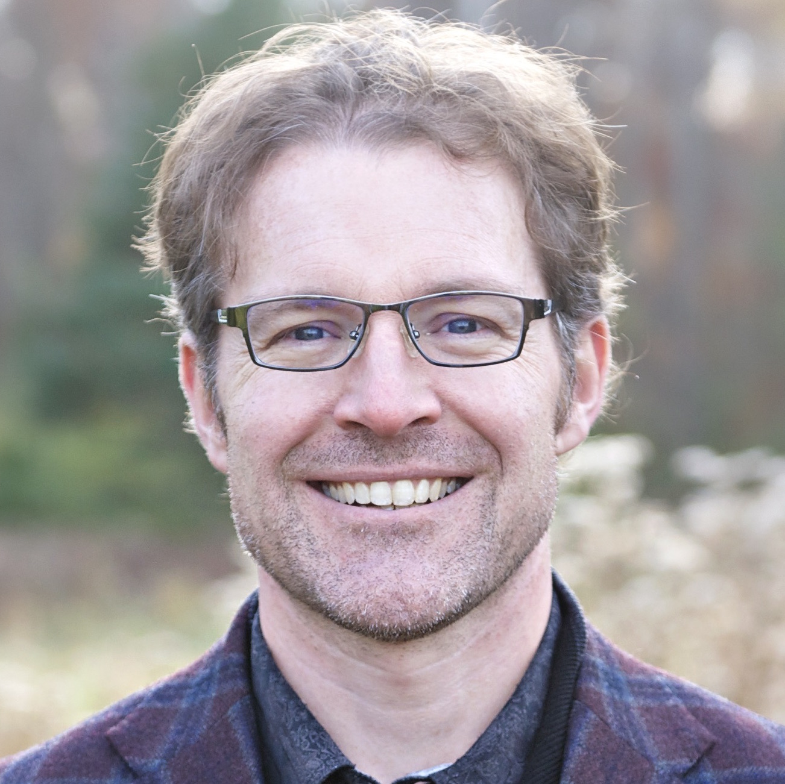

Jeremy Siek is a Professor of Computer Science in the School of
Informatics and Computing at Indiana University. Jeremy teaches
courses in programming, programming languages, compilers, logic, and
other areas of computer science. Jeremy designs new language features
to help programmers create and use software libraries and
domain-specific languages, especially generic and high-performance
ones. In particular, with Walid Taha, Jeremy invented the 
[gradual typing](./WhatIsGradualTyping.md) approach to mixing
static and dynamic type checking within the
same language. Prior to that, Jeremy co-authored the
[Boost Graph Library](http://www.boost.org/doc/libs/1_55_0/libs/graph/doc/index.html)
and attempted to add concepts to C++. Jeremy is a member of
the [Center for Programming Systems](https://luddy.indiana.edu/research/centers/center-programming-systems.html) at IU.

Office: Luddy Hall 3016, [Blog](http://siek.blogspot.com/), [github](https://github.com/jsiek/),
[CV](./resume.pdf), Mastadon: `@jeremysiek@types.pl`, [google scholar](https://scholar.google.com/citations?user=Vuso8H8AAAAJ)

# Deduce Proof Assistant

The Deduce proof assistant is an educational tool that helps students
to develop correct code. You can read about it on the [web page for
Deduce](https://jsiek.github.io/deduce/) and from a [series of blog
posts](http://siek.blogspot.com/2024/06/data-structures-and-algorithms-correctly.html)
that I have been writing.

# Phishing Scam: Research Assistant Position

There is an ongoing email phishing scam that is using my name. If you
receive an email offering you a job without first meeting with me in
person, please report it to phishing@iu.edu. Please do not send me
email to check whether it is legitimate. Thank you.

# Books

* Essentials of Compilation:  [Racket version](https://mitpress.mit.edu/9780262047760/essentials-of-compilation/) and
  [Python version](https://mitpress.mit.edu/9780262048248/essentials-of-compilation/)
* The Boost Graph Library ([ebook](https://www.informit.com/store/boost-graph-library-user-guide-and-reference-manual-9780132651837) from Pearson, [print](https://www.amazon.com/Boost-Graph-Library-Reference-Manual/dp/0201729148) from Amazon)

# Technology Transfer

I’ve been fortunate to see some of my ideas get used in the software industry:

* Microsoft created a gradually-typed dialect of JavaScript, called TypeScript.
* Facebook added gradual typing to PHP.
* Facebook created Flow, a static type checker for JavaScript.

# Recent Papers and Talks

The full list is available on Google Scholar and DBLP. 
<!--Also, see further below for “authorizer” links to my ACM publications.-->

* [Gradual Guarantee via Step-Indexed Logical Relations in Agda](https://cgi.cse.unsw.edu.au/~eptcs/paper.cgi?PT2024.3). Jeremy
  G. Siek. In Festschrift in Honor of Peter Thiemann’s Sixtieth
  Birthday, August 2024, EPTCS 413.
* [Quest Complete: the Holy Grail of Gradual Security](https://dl.acm.org/doi/10.1145/3656442). Tianyu Chen and
  Jeremy G. Siek. In PLDI 2024.
* An Introduction to Step-indexed Logical Relations via Type Safety
  for STLC + fix. Jeremy G. Siek. IU PL Wonks, November 2023. video
  and slides
* Mechanized Noninterference for Gradual Security. Tianyu Chen and
  Jeremy G. Siek. Draft on [arXiv](https://arxiv.org/abs/2211.15745). November 2022.
* [Parameterized cast calculi and reusable meta-theory for gradually typed lambda calculi.](https://doi.org/10.1017/S0956796821000241) 
  Jeremy G. Siek and Tianyu Chen. Article in
  Journal of Functional Programming. November 2021.
* [Blame and coercion: Together again for the first time](https://www.doi.org/10.1017/S0956796821000101).
  Jeremy G. Siek, Peter Thiemann, and Philip Wadler. Article in the Journal
  of Functional Programming. October 2021.
* Filter Models for Compiler Correctness. Invited Talk at the workshop
  on Intersection Types and Related Systems (ITRS) 2021. video and
  slides.

# Teaching

* P423/P523: Compilers (aka. Programming Language Implementation) Fall
  2024, Fall 2023, Fall 2022, Fall 2021, Fall 2020, Fall 2018, Spring
  2016, Spring 2014
* C343/H343: Data Structures [Spring 2025](https://iudatastructurescourse.github.io/course-web-page-spring-2025/),
    [Fall 2024](https://iudatastructurescourse.github.io/course-web-page-fall-2024/), [Spring 2024](https://iudatastructurescourse.github.io/course-web-page-spring-2024/), Fall 2023, Fall 2022, Fall 2021, Fall 2019, Fall 2017, Fall 2016, Fall
  2015, Fall 2014, Fall 2013
* B505/I500: Applied Algorithms Spring 2021
* B522: Programming Language Foundations Spring 2020, Spring 2015
* B629: Topics in PL: Denotational Semantics Spring 2018
* C++, Short and Sweet, an Online C++ Course for Beginners at Udemy.

# Students

* Tianyu Chen (Ph.D. student, Gradual information flow types for security)
* Darshal Shetty (Ph.D. student, Gradual Dependent Types)

# Alumni

* Andre Kuhlenschmidt (Meta, Software Engineer)
* Matthew Heimerdinger (Two Six Technologies, Research Scientist)
* Deyaaeldeen Almahallawi (Microsoft, Senior Software Engineer, Ph.D. thesis: Towards Efficient Gradual Typing via Monotonic References and Coercions)
* Kuang-Chen Lu (Brown Univ., M.S. thesis: Equivalence of Cast Representations in Gradual Typing)
* Michael M. Vitousek (Facebook, Ph.D. thesis: Gradual Typing for Python, Unguarded)
* Chris Wailes (Google, Software Engineer)
* Matteo Cimini (Assistant Professor, Univ. of Massachusetts Lowell)
* Spenser Bauman (Ph.D. student, Meta-tracing JIT for Racket)
* Di Zhong (Undergraduate Research, now Ph.D. student at Northeastern Univ.)
* Zeina Migeed (Research co-op from Northeastern, now Research Scientist at Meta)
* Steev Young (Undergraduate Research in Gradual Typing)
* Josie Bealle (Summer Research Opportunity in Computing)
* Andre Yuri (Summer Research Opportunity in Computing)
* Weiyu Miao (LinkedIn) Ph.D. thesis: Reflective Metaprogramming
* Geoffrey Belter (Apple) Ph.D. thesis: Efficient Generation of Sequences of Dense Linear Algebra through Auto-Tuning
* Shashank Bharadwaj (VMware)
* Jonathan Turner (Microsoft Typescript => Mozilla Rust => self employed)
* Erik Silkensen (Software Engineer, Meta)
* Neelam Agrawal (Senior Software Engineer, Google)
* Sri Teja Basava (Principal Software Engineer, National Instruments)
* Ian Karlin (Principal Engineer, HPC Ecosystems at NVIDIA)
* Justin Gottschlich (Parallel Computing Lab @ Intel Labs)
  Ph.D. thesis: Invalidating Transactions: Optimizations, Theory, Guarantees, and Unification
* Moss Prescott (SlamData) M.S. thesis: Speaking for the Trees: a New (Old) Approach to Languages and Syntax
* Christopher Schwaab (Ph.D. student at the Univ. of St. Andrews)
* David Broman (Full Prof. at KTH Royal Inst. of Tech., Sweden)
  Ph.D. thesis: Meta-Languages and Semantics for Equation-Based Modeling and Simulation

<!--
# Authorizor (Free) Links to ACM Publications

* ACM DL Author-ize serviceToward efficient gradual typing for structural types via coercions
    Andre Kuhlenschmidt, Deyaaeldeen Almahallawi, Jeremy G. Siek
    PLDI 2019: Proceedings of the 40th ACM SIGPLAN Conference on Programming Language Design and Implementation, 2019
* Gradual typing: a new perspective
    Giuseppe Castagna, Victor Lanvin, Tommaso Petrucciani, Jeremy G. Siek
    Proceedings of the ACM on Programming Languages, 2019.
* Sound gradual typing: only mostly dead
    Spenser Bauman, Carl Friedrich Bolz-Tereick, Jeremy Siek, Sam Tobin-Hochstadt
    Proceedings of the ACM on Programming Languages, 2017.
* Gradually typed symbolic expressions
    David Broman, Jeremy G. Siek
    PEPM ’18 Proceedings of the ACM SIGPLAN Workshop on Partial Evaluation and Program Manipulation, 2017
* Theorems for free for free: parametricity, with and without types
    Amal Ahmed, Dustin Jamner, Jeremy G. Siek, Philip Wadler
    Proceedings of the ACM on Programming Languages, 2017.
* Big types in little runtime: open-world soundness and collaborative blame for gradual type systems
    Michael M. Vitousek, Cameron Swords, Jeremy G. Siek
    POPL 2017 Proceedings of the 44th ACM SIGPLAN Symposium on Principles of Programming Languages, 2017.
* Automatically generating the dynamic semantics of gradually typed languages
    Matteo Cimini, Jeremy G. Siek
    POPL 2017 Proceedings of the 44th ACM SIGPLAN Symposium on Principles of Programming Languages, 2017.
* The gradualizer: a methodology and algorithm for generating gradual type systems
    Matteo Cimini, Jeremy G. Siek
    POPL ’16 Proceedings of the 43rd Annual ACM SIGPLAN-SIGACT Symposium on Principles of Programming Languages, 2016.
* Pycket: a tracing JIT for a functional language
    Spenser Bauman, Carl Friedrich Bolz, Robert Hirschfeld, Vasily Kirilichev, Tobias Pape, Jeremy G. Siek, Sam Tobin-Hochstadt
    ICFP 2015 Proceedings of the 20th ACM SIGPLAN International Conference on Functional Programming, 2015.
* Blame and coercion: together again for the first time
    Jeremy Siek, Peter Thiemann, Philip Wadler
    PLDI ’15 Proceedings of the 36th ACM SIGPLAN Conference on Programming Language Design and Implementation, 2015
* Reliable Generation of High-Performance Matrix Algebra
    Thomas Nelson, Geoffrey Belter, Jeremy G. Siek, Elizabeth Jessup, Boyana Norris
    ACM Transactions on Mathematical Software (TOMS), 2015.
* Design and evaluation of gradual typing for python
    Michael M. Vitousek, Andrew M. Kent, Jeremy G. Siek, Jim Baker
    DLS ’14 Proceedings of the 10th ACM Symposium on Dynamic languages, 2014
* Interpretations of the gradually-typed lambda calculus
    Jeremy G. Siek, Ronald Garcia
    Scheme ’12 Proceedings of the 2012 Annual Workshop on Scheme and Functional Programming, 2012. PDF with corrections
* Blame for all
    Amal Ahmed, Robert Bruce Findler, Jeremy G. Siek, Philip Wadler
    ACM SIGPLAN Notices – POPL ’11, 2011.
* Threesomes, with and without blame
    Jeremy G. Siek, Philip Wadler
    POPL ’10 Proceedings of the 37th annual ACM SIGPLAN-SIGACT symposium on Principles of programming languages, 2010.
* Gradual typing with unification-based inference
    Jeremy G. Siek, Manish Vachharajani
    DLS ’08 Proceedings of the 2008 symposium on Dynamic languages, 2008.
* Concepts: linguistic support for generic programming in C++
    Douglas Gregor, Jaakko Järvi, Jeremy Siek, Bjarne Stroustrup, Gabriel Dos Reis, Andrew Lumsdaine
    OOPSLA ’06 Proceedings of the 21st annual ACM SIGPLAN conference on Object-oriented programming systems, languages, and applications, 2006
* Essential language support for generic programming
    Jeremy G. Siek, Andrew Lumsdaine
    ACM SIGPLAN Notices – Proceedings of the 2005 ACM SIGPLAN conference on Programming language design and implementation, 2005.
* A comparative study of language support for generic programming
    Ronald Garcia, Jaakko Jarvi, Andrew Lumsdaine, Jeremy G. Siek, Jeremiah Willcock
    OOPSLA ’03 Proceedings of the 18th annual ACM SIGPLAN conference on Object-oriented programing, systems, languages, and applications, 2003
* The generic graph component library
    Lie-Quan Lee, Jeremy G. Siek, Andrew Lumsdaine
    OOPSLA ’99 Proceedings of the 14th ACM SIGPLAN conference on Object-oriented programming, systems, languages, and applications, 1999
-->
